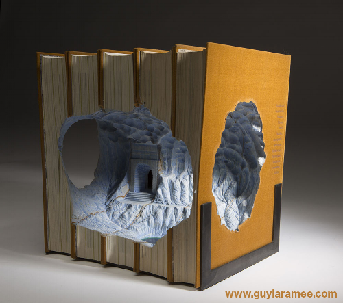

During my time as a junior level designer, I was primarily occupied with learning how to function in a production environment on a basic level. I ignored the fact that my first project had a suggested reading list meant to inspire everyone and get them in the right mindset to create amazing content. Now, as I’ve become a more senior level designer, I’ve learned the value of looking at these suggested reading lists and actually picking out a few books to devour because, in doing this, I’d argue that it has made me a better level designer during the pitching phase.[^1] (To the narrative designers and writers who put these lists together: I salute and appreciate you. To everyone else: don’t forget to externally share the fantastic reads that were suggested to you!) 

While I encourage you to read stuff from the suggested list if your project has one, that’s not the real intent of this post. I actually want to share a practical tip that will allow you to deepen your “well of inspiration” in a way that runs parallel to any reading lists your project might have. The tip I’m about to share aims to make you a more well-rounded designer, is is low-cost – to the point of sometimes being free – and won’t require a large time investment. The tip is simply to read more short stories.

>*Image credit: Guy Laramee.*

There are a lot of methods to access short stories and I’m sure I’ll miss a few here. I’m granting advance clearance to cause a ruckus in the comments if you have other sources you’d like to share. You can [read great short stories online for free](http://www.alayadawnjohnson.com/a-guide-to-the-fruits-of-hawaii/#top), grab magazines focused on the shorter form, [get them as free monthly bonuses for signing up to book publisher e-mailing lists](https://reactormag.com/newsletter/), narrative designers and writers on your team might have penned their own, and so on. You can usually find them in any genre you like too! The most time- and cost-effective way I recommend, however, is to pick up a end-of-year “best of” collection for any genre you’re interested in. (You might notice in that link that collections of exceptional non-fiction writing exist as well.) These collections are often curated by short story writers and/or magazine editors, giving you peace of mind knowing that you’re only getting The Best Stuff™. I’ve always been a fan of speculative fiction, and as a result, I’ve recently made a habit of picking up [The Best American Science Fiction And Fantasy](https://en.wikipedia.org/wiki/The_Best_American_Series) collections when they drop every year.

Find something that appeals to you as a reader or something that neatly aligns itself with the project you are working on – or even both if you can manage it. Dedicate small chunks of time to reading, perhaps during your lunch hour or if you have a commute that involves taking transit. Don’t feel pressure to read every single story in a collection if any given story fails to grab you. You can always come back to a story later.

An expertly-curated collection of short stories exposes you to works from a variety of diverse voices that will challenge the key concepts at the core of that genre. I'll make a quick aside to stress short stories as a more diverse (and therefore more valuable) form compared to the likes of film, television, and even longform novels at times, but that's another discussion entirely. Once you’ve read a few short stories that move you, see if you can find some way to re-imagine and work in a character, a concept, a plot beat, a locale, or even just a sly reference in your own work. If something in these stories surprised or challenged you in some way, the twist you apply to feature that in your own work might have a similar impact on players.

Reading short stories will rapidly equip you with even more inspiration – inspiration that will augment what you’re already going to gain from your project’s suggested reading list. I truly believe that this tip will enable us to pitch, develop, and ship incredibly memorable content that our players will love. Thanks for reading!

 [^1]: During the production of Watch Dogs 2, for instance, reading books like [Ghost in the Wires](https://www.goodreads.com/book/show/10256723-ghost-in-the-wires), [How To Steal The Mona Lisa](https://www.goodreads.com/book/show/25853045-how-to-steal-the-mona-lisa), and [A Burglar’s Guide To The City](https://www.goodreads.com/book/show/22237142-a-burglar-s-guide-to-the-city) made me think differently about guarded spaces and how a player might enjoy (devising multiple ways of) breaking into them. Breaking and entering, after all, were key elements of the hacker fantasy we supported with a variety of design affordances. Without the benefit of reading these books, [I’m not sure the pitch for the mission I worked on would have been as strong](https://youtu.be/_zAjQk63fCA).
